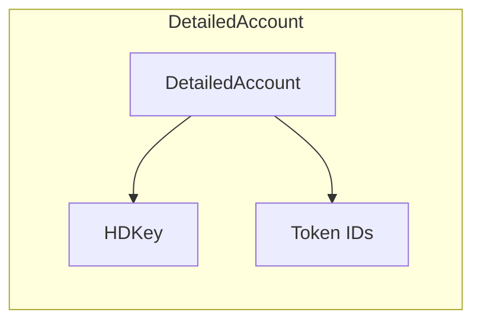
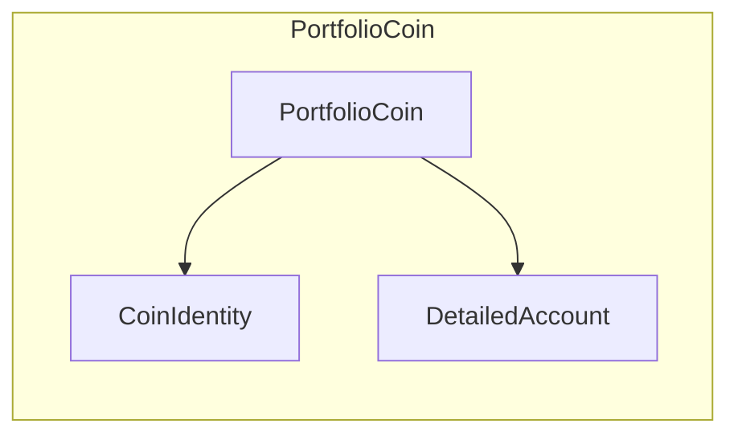
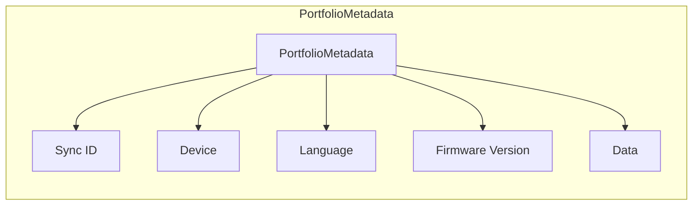
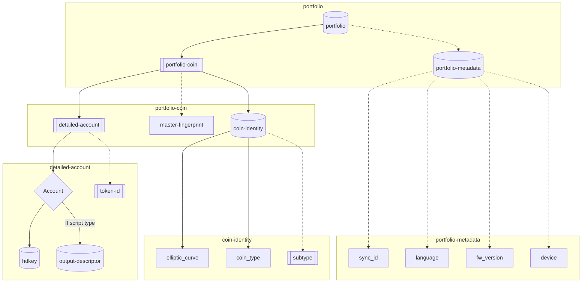

# Multi Layer Sync Protocol

This is the implementation of the [Multi Layer Sync Protocol](https://github.com/ngraveio/Research/blob/main/papers/nbcr-2023-002-multi-layer-sync.md) that supports multiple coins and accounts with different types via globally identifiable URs.

This package adds support for the following UR types:

| Type                      | [CBOR Tag](https://www.iana.org/assignments/cbor-tags/cbor-tags.xhtml) | Owner  | Description                                                                                               | Definition                                                                                                 |
| ------------------------- | ---------------------------------------------------------------------- | ------ | --------------------------------------------------------------------------------------------------------- | ---------------------------------------------------------------------------------------------------------- |
| `detailed-account`        | 41402                                                                   | Ngrave | Import multiple accounts with and without output descriptors and specify optionally tokens to synchronize | [NBCR-2023-002](https://github.com/ngraveio/Research/blob/main/papers/nbcr-2023-002-multi-layer-sync.md)   |
| `portfolio-coin`          | 41403                                                                   | Ngrave | Associate several accounts to its coin identity                                                           | [NBCR-2023-002](https://github.com/ngraveio/Research/blob/main/papers/nbcr-2023-002-multi-layer-sync.md)   |
| `portfolio`               | 41405                                                                   | Ngrave | Aggregate the portfolio information                                                                       | [NBCR-2023-002](https://github.com/ngraveio/Research/blob/main/papers/nbcr-2023-002-multi-layer-sync.md)   |


## Overview

### What is the Multi-Layer Sync Protocol?
The **Multi-Layer Sync Protocol (MLSP)** is a universal syncing mechanism designed for managing multiple cryptocurrency accounts, tokens, and portfolio structures efficiently. Unlike traditional single-account syncing, MLSP allows for:

- **Multi-coin synchronization** – Sync multiple cryptocurrencies within a single protocol instance.
- **Detailed account structures** – Support for hierarchical accounts with HD keys, token IDs, and additional metadata.
- **Efficient QR-based synchronization** – Enabling seamless transfer of account and portfolio data over **airgapped** systems using animated QR codes.

### Why was it created?
The protocol addresses key limitations in existing wallet synchronization solutions, which often:
- Require separate synchronization processes for different assets.
- Lack a structured way to **group multiple accounts under a single identity**.
- Do not efficiently handle **QR partitioning for large payloads**.

MLSP solves these issues by introducing **globally identifiable URs** that allow seamless synchronization across multiple layers of portfolio data.

---

## Index

- [Multi Layer Sync Protocol](#multi-layer-sync-protocol)
  - [Overview](#overview)
    - [What is the Multi-Layer Sync Protocol?](#what-is-the-multi-layer-sync-protocol)
    - [Why was it created?](#why-was-it-created)
  - [TOC](#toc)
  - [Installing](#installing)
  - [DetailedAccount](#detailedaccount)
    - [Explanation](#explanation)
    - [Construct a detailed account with HDKey](#construct-a-detailed-account-with-hdkey)
    - [Decode a detailed account with HDKey](#decode-a-detailed-account-with-hdkey)
  - [PortfolioCoin](#portfoliocoin)
    - [Explanation](#explanation-1)
    - [Create a PortfolioCoin with 2 detailed accounts with tokens](#create-a-portfoliocoin-with-2-detailed-accounts-with-tokens)
    - [Decode the PortfolioCoin with 2 detailed accounts with tokens](#decode-the-portfoliocoin-with-2-detailed-accounts-with-tokens)
  - [PortfolioMetadata](#portfoliometadata)
    - [Explanation](#explanation-2)
    - [Create a PortfolioMetadata](#create-a-portfoliometadata)
    - [Decode a PortfolioMetadata](#decode-a-portfoliometadata)
  - [Portfolio](#portfolio)
    - [Explanation](#explanation-3)
    - [Create a Portfolio with 4 coins and Metadata](#create-a-portfolio-with-4-coins-and-metadata)

## Installing

To install, run:

```bash
yarn add @ngraveio/ur-sync
```

```bash
npm install --save @ngraveio/ur-sync
```

```typescript
import { DetailedAccount, PortfolioCoin, PortfolioMetadata, Portfolio } from '@ngraveio/ur-sync';
```

## DetailedAccount

### Explanation

The `DetailedAccount` class represents an account with detailed information, including the HDKey and optional token IDs.



**CDDL Definition:**
```CDDL
account_exp = #6.40303(hdkey) / #6.40308(output-descriptor)

; Accounts are specified using either '#6.40303(hdkey)' or 
; '#6.40308(output-descriptor)'.
; By default, '#6.40303(hdkey)' should be used to share public keys and
; extended public keys.
; '#6.308(output-descriptor)' should be used to share an output descriptor, 
; e.g. for the different Bitcoin address formats (P2PKH, P2SH-P2WPKH, P2WPKH, P2TR).

; Optional 'token-ids' to indicate the synchronization of a list of tokens with
; the associated accounts
; 'token-id' is defined differently depending on the blockchain:
; - ERC20 tokens on EVM chains are identified by their contract addresses 
; (e.g. `0xA0b86991c6218b36c1d19D4a2e9Eb0cE3606eB48`)
; - ERC1155 tokens are identifed with their contract addresses followed by their 
; ID with ':' as separator (e.g. `0xfaafdc07907ff5120a76b34b731b278c38d6043c:
; 508851954656174721695133294256171964208`)
; - ESDT tokens on MultiversX are by their name followed by their ID with `-` as 
; separator (e.g. `USDC-c76f1f`)
; - SPL tokens on Solana are identified by their contract addresses
; (e.g. `EPjFWdd5AufqSSqeM2qN1xzybapC8G4wEGGkZwyTDt1v`)

detailed-account = { 
  account: account_exp,
  ? token-ids: [+ string / bytes] ; Specify multiple tokens associated to one account
}

account = 1
token-ids = 2
```

### Construct a detailed account with HDKey

```typescript
import { HDKey, Keypath } from '@ngraveio/ur-blockchain-commons';
import { DetailedAccount } from '@ngraveio/ur-sync';

// Create a path component
const originKeyPath = new Keypath({ path: "m/44'/501'/0'/0'" });

// Create a HDKey
const cryptoHDKey = new HDKey({
  isMaster: false,
  keyData: Buffer.from('02eae4b876a8696134b868f88cc2f51f715f2dbedb7446b8e6edf3d4541c4eb67b', 'hex'),
  origin: originKeyPath,
});

// Create detailed account
const detailedAccount = new DetailedAccount({
  account: cryptoHDKey,
});

const cbor = detailedAccount.toHex();
const ur = detailedAccount.toUr();

console.log(cbor);
// 'a101d99d6fa301f403582102eae4b876a8696134b868f88cc2f51f715f2dbedb7446b8e6edf3d4541c4eb67b06d99d70a10188182cf51901f5f500f500f5'
console.log(ur);
// 'ur:detailed-account/oyadtantjlotadwkaxhdclaowdverokopdinhseeroisyalksaykctjshedprnuyjyfgrovawewftyghceglrpkgamtantjooyadlocsdwykcfadykykaeykaeykionnimfd'
```

### Decode a detailed account with HDKey

```typescript
import { DetailedAccount } from '@ngraveio/ur-sync';

// CBOR result after scanning the QR code
const cbor = 'a101d99d6fa301f403582102eae4b876a8696134b868f88cc2f51f715f2dbedb7446b8e6edf3d4541c4eb67b06d99d70a10188182cf51901f5f500f500f5';

// Convert the CBOR data into the DetailedAccount
const detailedAccount = DetailedAccount.fromHex(cbor);

// Get HDKey
const hdKey = detailedAccount.getAccount();
```

## PortfolioCoin

### Explanation

The `PortfolioCoin` class represents a coin with multiple detailed accounts.



**CDDL Definition:**
```CDDL
; Associate a coin identity to its accounts

detailed_accounts = [+ #6.41402(detailed-account)]

; The accounts are listed using #6.41402(detailed-account) to share the maximum of information related to the accounts

coin = {
  coin-id: #6.41401(coin-identity),
  accounts: accounts_exp,
  ? master-fingerprint: uint32 ; Master fingerprint (fingerprint for the master public key as per BIP32)
}

; master-fingerprint must match the potential other fingerprints included in the other sub-UR types

coin-id = 1
accounts = 2
```

### Create a PortfolioCoin with 2 detailed accounts with tokens

```typescript
import { HDKey, Keypath } from '@ngraveio/ur-blockchain-commons';
import { DetailedAccount, PortfolioCoin } from '@ngraveio/ur-sync';
import { CoinIdentity, EllipticCurve } from '@ngraveio/ur-coin-identity';

// Create a coin identity
const coinIdentity = new CoinIdentity(EllipticCurve.secp256k1, 60);

// Create HDKeys
const cryptoHDKey = new HDKey({
  isMaster: false,
  keyData: Buffer.from('02d2b36900396c9282fa14628566582f206a5dd0bcc8d5e892611806cafb0301f0', 'hex'),
  origin: new Keypath({ path: "m/60'/0'/0'/0/0" }),
  parentFingerprint: 2017537594,
});

const tokenIds = ['0xdac17f958d2ee523a2206206994597c13d831ec7', '0xb8c77482e45f1f44de1745f52c74426c631bdd52'];

const cryptoHDKey2 = HDKey.fromHex('A203582102EAE4B876A8696134B868F88CC2F51F715F2DBEDB7446B8E6EDF3D4541C4EB67B06D99D70A10188182CF51901F5F500F500F5');

const tokenIds2 = ['EPjFWdd5AufqSSqeM2qN1xzybapC8G4wEGGkZwyTDt1v'];

// Create detailed accounts
const detailedAccount = new DetailedAccount({
  account: cryptoHDKey,
  tokenIds,
});
const detailedAccount2 = new DetailedAccount({
  account: cryptoHDKey2,
  tokenIds: tokenIds2,
});

// Create a PortfolioCoin
const portfolioCoin = new PortfolioCoin({
  coinId: coinIdentity,
  accounts: [detailedAccount, detailedAccount2],
});

const cbor = portfolioCoin.toHex();
const ur = portfolioCoin.toUr();

console.log(cbor);
// 'a201d99d6fa2010802183c0282d99d70a201d99d6fa303582102d2b36900396c9282fa14628566582f206a5dd0bcc8d5e892611806cafb0301f006d99d70a1018a183cf500f500f500f401f4021ad34db33f081a78412e3a0282d9010754dac17f958d2ee523a2206206994597c13d831ec7d9010754b8c77482e45f1f44de1745f52c74426c631bdd52d99d70a201d99d6fa203582102eae4b876a8696134b868f88cc2f51f715f2dbedb7446b8e6edf3d4541c4eb67b06d99d70a10188182cf51901f5f500f500f50281782c45506a465764643541756671535371654d32714e31787a7962617043384734774547476b5a77795444743176'
console.log(ur);
// 'ur:portfolio-coin/oeadtantjloxadwkaxhdclaotdqdinaeesjzmolfzsbbidlpiyhddlcximhltirfsptlvsmohscsamsgzoaxadwtamtantjooeadlecsfnykaeykaeykaewkadwkaocytegtqdfhaycyksfpdmftaolytaadatghnbroinmeswclluensettntgedmnnpftoenamwmfdjlfpcltt'
```

### Decode the PortfolioCoin with 2 detailed accounts with tokens

```typescript
import { PortfolioCoin } from '@ngraveio/ur-sync';

// CBOR taken from the example above
const cbor = 'a201d99d6fa2010802183c0282d99d70a201d99d6fa303582102d2b36900396c9282fa14628566582f206a5dd0bcc8d5e892611806cafb0301f006d99d70a1018a183cf500f500f500f401f4021ad34db33f081a78412e3a0282d9010754dac17f958d2ee523a2206206994597c13d831ec7d9010754b8c77482e45f1f44de1745f52c74426c631bdd52d99d70a201d99d6fa203582102eae4b876a8696134b868f88cc2f51f715f2dbedb7446b8e6edf3d4541c4eb67b06d99d70a10188182cf51901f5f500f500f50281782c45506a465764643541756671535371654d32714e31787a7962617043384734774547476b5a77795444743176';

const portfolioCoin = PortfolioCoin.fromHex(cbor);

// Get the coin ID
const coinID = portfolioCoin.getCoinId();
// Get the accounts
const accounts = portfolioCoin.getAccounts();
```

## PortfolioMetadata

### Explanation

The `PortfolioMetadata` class represents metadata associated with a portfolio, including sync ID, device information, language, firmware version, and additional data.


**CDDL Definition:**
```CDDL
metadata = {
		? sync_id: bytes .size 16     ; Generated by the hardware wallet to identify 
the device
		? language: language_code,    ; Indicates the selected language 
on the hardware wallet
		? fw_version: string,         ; Firmware version of the hardware wallet
		? device: string              ; Indicates the device name
}

sync_id = 1
language = 2
fw_version = 3
device = 4

language_code = string ; following [ISO 639-1] Code (e.g. "en" for English, 
"fr" for French, "nl" for Dutch and "es" for Spanish
```

### Create a PortfolioMetadata

```typescript
import { PortfolioMetadata } from '@ngraveio/ur-sync';
import { Buffer } from 'buffer';

// Create sync id
const syncId = Buffer.from('babe0000babe00112233445566778899', 'hex');

// Create metadata
const metadata = new PortfolioMetadata({
  syncId,
  device: 'my-device',
  language: 'en',
  firmwareVersion: '1.0.0',
  string: 'hello world',
  number: 123,
  boolean: true,
  array: [1, 2, 3],
  object: { a: 1, b: 2 },
  null: null,
  date: new Date('2021-01-01T00:00:00.000Z'),
});

const cbor = metadata.toHex();
const ur = metadata.toUr();

console.log(cbor);
// 'ab0150babe0000babe001122334455667788990262656e0365312e302e3004696d792d64657669636566737472696e676b68656c6c6f20776f726c64666e756d626572187b67626f6f6c65616ef565617272617983010203666f626a656374a2616101616202646e756c6cf66464617465c11a5fee6600'
console.log(ur);
// 'ur:portfolio-metadata/pyadgdrdrnaeaerdrnaebycpeofygoiyktlonlaoidihjtaxihehdmdydmdyaainjnkkdpieihkoiniaihiyjkjyjpinjtiojeisihjzjzjlcxktjljpjzieiyjtkpjnidihjpcskgioidjljljzihhsjtykihhsjpjphskklsadaoaxiyjlidimihiajyoehshsadhsidaoiejtkpjzjzynieiehsjyihsecyhewyiyaeahhngoeo'
```

### Decode a PortfolioMetadata

```typescript
import { PortfolioMetadata } from '@ngraveio/ur-sync';

// CBOR result after scanning the QR code
const cbor = 'ab0150babe0000babe001122334455667788990262656e0365312e302e3004696d792d64657669636566737472696e676b68656c6c6f20776f726c64666e756d626572187b67626f6f6c65616ef565617272617983010203666f626a656374a2616101616202646e756c6cf66464617465c11a5fee6600';

// Convert the CBOR data into the PortfolioMetadata
const metadata = PortfolioMetadata.fromHex(cbor);

console.log(metadata.getSyncId()?.toString('hex')); // 'babe0000babe00112233445566778899'
console.log(metadata.getlanguage()); // 'en'
console.log(metadata.getDevice()); // 'my-device'
console.log(metadata.getFirmwareVersion()); // '1.0.0'
console.log(metadata.data); // { string: 'hello world', number: 123, boolean: true, array: [1, 2, 3], object: { a: 1, b: 2 }, null: null, date: new Date('2021-01-01T00:00:00.000Z') }
```

## Portfolio

### Explanation

The `Portfolio` class represents a collection of coins and associated metadata.



**CDDL Definition:**
```CDDL
; Top level multi coin sync payload

sync = {
		coins: [+ #6.41403(portfolio-coin)],           ; Multiple coins with their respective accounts and coin identities
		? metadata: #6.41404(portfolio-metadata) ; Optional wallet metadata
}

coins = 1
metadata = 2
```

### Create a Portfolio with 4 coins and Metadata

```typescript
import { HDKey, Keypath, OutputDescriptor } from '@ngraveio/ur-blockchain-commons';
import { DetailedAccount, PortfolioCoin, Portfolio, PortfolioMetadata } from '@ngraveio/ur-sync';
import { CoinIdentity, EllipticCurve } from '@ngraveio/ur-coin-identity';
import { Buffer } from 'buffer';

// Create the coin identities of the 4 desired coins.
const coinIdEth = new CoinIdentity(EllipticCurve.secp256k1, 60);
const coinIdSol = new CoinIdentity(EllipticCurve.secp256k1, 501);
const coinIdMatic = new CoinIdentity(EllipticCurve.secp256k1, 60, [137]);
const coinIdBtc = new CoinIdentity(EllipticCurve.secp256k1, 0);

// Create the accounts that will be included in the coins.
// Ethereum with USDC ERC20 token
const accountEth = new DetailedAccount({
  account: new HDKey({
    isMaster: false,
    keyData: Buffer.from('032503D7DCA4FF0594F0404D56188542A18D8E0784443134C716178BC1819C3DD4', 'hex'),
    chainCode: Buffer.from('D2B36900396C9282FA14628566582F206A5DD0BCC8D5E892611806CAFB0301F0', 'hex'),
    origin: new Keypath({ path: "m/44'/60'/0'" }),
    children: new Keypath({ path: "0/1" }),
  }),
  tokenIds: ['0xA0b86991c6218b36c1d19D4a2e9Eb0cE3606eB48'], // USDC ERC20 token on Ethereum
});

// Polygon with USDC ERC20 token
const accountMatic = new DetailedAccount({
  account: new HDKey({
    isMaster: false,
    keyData: Buffer.from('032503D7DCA4FF0594F0404D56188542A18D8E0784443134C716178BC1819C3DD4', 'hex'),
    chainCode: Buffer.from('D2B36900396C9282fa14628566582F206A5DD0BCC8D5E892611806CAFB0301F0', 'hex'),
    origin: new Keypath({ path: "m/44'/60'/0'" }),
    children: new Keypath({ path: "0/1" }),
  }),
  tokenIds: ['2791Bca1f2de4661ED88A30C99A7a9449Aa84174'], // USDC ERC20 token on Polygon
});

// Solana with USDC SPL token
const accountSol = new DetailedAccount({
  account: new HDKey({
    isMaster: false,
    keyData: Buffer.from('02EAE4B876A8696134B868F88CC2F51F715F2DBEDB7446B8E6EDF3D4541C4EB67B', 'hex'),
    origin: new Keypath({ path: "m/44'/501'/0'/0" }),
  }),
  tokenIds: ['EPjFWdd5AufqSSqeM2qN1xzybapC8G4wEGGkZwyTDt1v'], // USDC SPL token
});

// Account with crypto-output public key hash
const accountBtc = new DetailedAccount({
  account: new OutputDescriptor({
    source: 'pkh(@0)',
    keys: [
      new HDKey({
        isMaster: false,
        keyData: Buffer.from('03EB3E2863911826374DE86C231A4B76F0B89DFA174AFB78D7F478199884D9DD32', 'hex'),
        chainCode: Buffer.from('6456A5DF2DB0F6D9AF72B2A1AF4B25F45200ED6FCC29C3440B311D4796B70B5B', 'hex'),
        origin: new Keypath({ path: "m/44'/0'/0'/0/0" }),
        children: new Keypath({ path: "0/0" }),
      }),
    ],
  }),
});

// Create the coins
const cryptoCoinEth = new PortfolioCoin({ coinId: coinIdEth, accounts: [accountEth] });
const cryptoCoinSol = new PortfolioCoin({ coinId: coinIdSol, accounts: [accountSol] });
const cryptoCoinMatic = new PortfolioCoin({ coinId: coinIdMatic, accounts: [accountMatic] });
const cryptoCoinBtc = new PortfolioCoin({ coinId: coinIdBtc, accounts: [accountBtc] });

// Create the metadata.
const metadata = new PortfolioMetadata({
  syncId: Buffer.from('123456781234567802D9044FA3011A71', 'hex'),
  language: 'en',
  firmwareVersion: '1.2.1-1.rc',
  device: 'NGRAVE ZERO',
});

// Create the Portfolio
const portfolio = new Portfolio({ coins: [cryptoCoinEth, cryptoCoinSol, cryptoCoinMatic, cryptoCoinBtc], metadata });

const cbor = portfolio.toHex();
const ur = portfolio.toUr();

console.log(cbor);
// 'a20184d9057ba201d90579a3010802183c03f70281d9057aa201d99d6fa4035821032503d7dca4ff0594f0404d56188542a18d8e0784443134c716178bc1819c3dd4045820d2b36900396c9282fa14628566582f206a5dd0bcc8d5e892611806cafb0301f006d99d70a10186182cf5183cf500f507d99d70a1018400f401f40281d9010754a0b86991c6218b36c1d19d4a2e9eb0ce3606eb48d9057ba201d90579a30108021901f503f70281d9057aa201d99d6fa203582102eae4b876a8696134b868f88cc2f51f715f2dbedb7446b8e6edf3d4541c4eb67b06d99d70a10188182cf51901f5f500f500f50281782c45506a465764643541756671535371654d32714e31787a7962617043384734774547476b5a77795444743176d9057ba201d90579a3010802183c038118890281d9057aa201d99d6fa4035821032503d7dca4ff0594f0404d56188542a18d8e0784443134c716178bc1819c3dd4045820d2b36900396c9282fa14628566582f206a5dd0bcc8d5e892611806cafb0301f006d99d70a10186182cf5183cf500f507d99d70a1018400f401f40281d90107542791bca1f2de4661ed88a30c99a7a9449aa84174d9057ba201d90579a30108020003f70281d9057aa101d90134d90193d99d6fa403582103eb3e2863911826374de86c231a4b76f0b89dfa174afb78d7f478199884d9dd320458206456a5df2db0f6d9af72b2a1af4b25f45200ed6fcc29c3440b311d4796b70b5b06d99d70a10186182cf500f500f507d99d70a1018400f400f402d9057ca40150123456781234567802d9044fa3011a710262656e036a312e322e312d312e7263046b4e4752415645205a45524f'
console.log(ur);
// 'ur:portfolio/oeadtantjloxadwkaxhdclaotdqdinaeesjzmolfzsbbidlpiyhddlcximhltirfsptlvsmohscsamsgzoaxadwtamtantjooeadlecsfnykaeykaeykaewkadwkaocytegtqdfhaycyksfpdmftaolytaadatgh
```